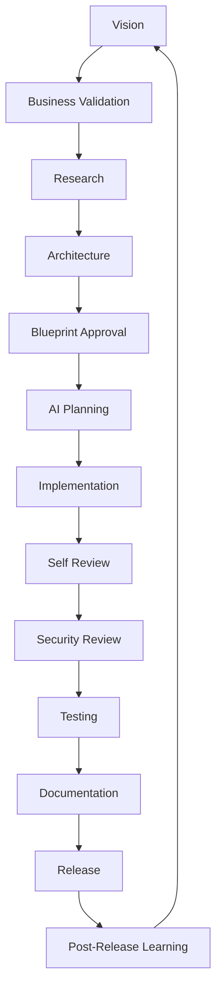

# AI Development Lifecycle (AIDL)

## The Disciplined Workflow for AI-Augmented Engineering

> **Vestara treats AI as a team of disciplined specialists working from a shared constitution — not as a code generator.**

---

## ═══════════════════════════════════════════════════════════════════

### 🎯 PHILOSOPHY

### ═══════════════════════════════════════════════════════════════════

Traditional SDLC assumes human developers. AIDL assumes **AI agents with specialized roles** working from **shared governance**.

| Traditional SDLC | AIDL |
|------------------|------|
| Requirements → Design → Code → Test → Deploy | Vision → Research → Architecture → Blueprint → AI Planning → Implementation → Self-Review → Security → Test → Docs → Release → Learn |
| One developer, many hats | Specialist agents, shared context |
| Documentation after | Documentation **before** (Blueprint-first) |
| Technical debt accidental | Technical debt **explicit** (tracked, approved) |
| Architecture emerges | Architecture **governed** (ADR required) |

---

## ═══════════════════════════════════════════════════════════════════

### 🔄 THE AIDL PHASES

### ═══════════════════════════════════════════════════════════════════



### Phase 1: VISION

- **Owner**: Chief Architect / Product Manager
- **Input**: Market signals, user feedback, strategic goals
- **Output**: Vision statement, success criteria, generation target
- **Gate**: Aligns with 5-generation roadmap?

### Phase 2: BUSINESS VALIDATION

- **Owner**: Product Manager
- **Input**: Vision
- **Output**: Business case, ROI, user stories, acceptance criteria
- **Gate**: Worth building? Fits product strategy?

### Phase 3: RESEARCH

- **Owner**: Research Agent
- **Input**: Problem statement, constraints
- **Output**: Research report (tech, competitors, papers, benchmarks)
- **Gate**: Sufficient evidence for architecture?

### Phase 4: ARCHITECTURE

- **Owner**: Software Architect
- **Input**: Research report, business requirements
- **Output**: Architecture spec (ADR), module boundaries, data models, APIs
- **Gate**: Chief Architect approval? No circular deps? Fits Blueprint?

### Phase 5: BLUEPRINT APPROVAL

- **Owner**: Chief Architect + Engineering Manager
- **Input**: Architecture spec
- **Output**: Updated Blueprint volumes, updated decision log
- **Gate**: All affected volumes updated? Migration plan exists?

### Phase 6: AI PLANNING

- **Owner**: Engineering Manager (AI)
- **Input**: Approved Blueprint, architecture spec
- **Output**: Task breakdown, agent assignments, dependencies, test plan
- **Gate**: Tasks are atomic, testable, ordered?

### Phase 7: IMPLEMENTATION

- **Owner**: Developer Agents (Frontend, Backend, AI, DevOps)
- **Input**: Task spec, Blueprint, engineering rules
- **Output**: Code, tests, migration scripts
- **Gate**: `pnpm lint && pnpm typecheck && pnpm build && pnpm test` passes

### Phase 8: SELF REVIEW

- **Owner**: Reviewer Agent
- **Input**: Implementation, original task spec
- **Output**: Review report (correctness, patterns, performance, security)
- **Gate**: No blocking issues? Follows Blueprint?

### Phase 9: SECURITY REVIEW

- **Owner**: Security Engineer Agent
- **Input**: Implementation, threat model
- **Output**: Security assessment, vulnerabilities, mitigations
- **Gate**: Zero critical/high? Threat model updated?

### Phase 10: TESTING

- **Owner**: QA Engineer Agent
- **Input**: Implementation, test plan
- **Output**: Test results, coverage report, regression status
- **Gate**: Coverage thresholds met? No regressions?

### Phase 11: DOCUMENTATION

- **Owner**: Documentation Engineer Agent
- **Input**: Implementation, Blueprint gaps
- **Output**: Updated Blueprint, API docs, examples, changelog
- **Gate**: All public APIs documented? Blueprint current?

### Phase 12: RELEASE

- **Owner**: DevOps Engineer Agent
- **Input**: Tagged commit, release notes
- **Output**: Docker images, .deb packages, ISO, GitHub Release
- **Gate**: CI green? Signatures verified? Rollback plan?

### Phase 13: POST-RELEASE LEARNING

- **Owner**: Research Agent + Product Manager
- **Input**: Metrics, user feedback, incidents
- **Output**: Learning report, Blueprint improvements, next cycle input
- **Gate**: Lessons captured? Blueprint updated?

---

## ═══════════════════════════════════════════════════════════════════

### 🤖 AGENT ROLES & RESPONSIBILITIES

### ═══════════════════════════════════════════════════════════════════

| Agent | Phase(s) | Mission | Never |
|-------|----------|---------|-------|
| **Chief Architect** | 1, 4, 5 | Protect long-term architecture | Write quick hacks |
| **Product Manager** | 2, 13 | Protect user value | Ignore business priorities |
| **Research Agent** | 3, 13 | Investigate, report | Implement code |
| **Software Architect** | 4 | API, DB, modules, DDD, events | Skip ADR |
| **Frontend Engineer** | 7 | React, UI, a11y, perf | Skip tests |
| **Backend Engineer** | 7 | Fastify, queues, auth, caching | Hardcode config |
| **AI Engineer** | 7 | Providers, prompts, memory, RAG, agents | Single-provider assumptions |
| **DevOps Engineer** | 7, 12 | Docker, CI/CD, monitoring, infra | Manual deployments |
| **Security Engineer** | 9 | Threat model, secrets, encryption, OWASP | Skip review |
| **QA Engineer** | 10 | Test, regression, perf, load, a11y | Ship untested |
| **Documentation Engineer** | 11 | Blueprint, API docs, guides, architecture | Let docs rot |
| **Reviewer Agent** | 8 | Correctness, patterns, perf, security | Approve without reading |
| **Engineering Manager** | 6 | Task breakdown, agent coordination | Micromanage implementation |

---

## ═══════════════════════════════════════════════════════════════════

### 📋 AGENT INTERACTION PROTOCOL

### ═══════════════════════════════════════════════════════════════════

### Shared Context (Every Agent Reads)

```
1. 00-governance/01-ai-constitution.md      ← MASTER PROMPT
2. 00-governance/02-engineering-rules.md     ← NON-NEGOTIABLE RULES
3. 00-governance/03-ai-development-lifecycle.md  ← THIS DOCUMENT
4. 00-governance/04-decision-log/latest.md   ← CURRENT ARCHITECTURE
5. RELEVANT BLUEPRINT VOLUME(S)              ← SPEC FOR TASK
```

### Handoff Format (Phase N → Phase N+1)

```markdown
## HANDOFF: Phase N → Phase N+1

**From**: [Agent Role]
**To**: [Agent Role]
**Date**: 2025-01-15

### Summary
[2-3 sentences what was done]

### Artifacts Produced
- [Link/Path to output]

### Decisions Made
- [Key decisions with rationale]

### Blockers / Risks
- [Any issues for next phase]

### Next Phase Requirements
- [What next agent needs to know/do]
```

### Dispute Resolution

1. **Agent-to-Agent**: Direct discussion in PR/comments
2. **Escalation**: Engineering Manager arbitrates
3. **Final**: Chief Architect decides (architecture), Product Manager decides (scope)

---

## ═══════════════════════════════════════════════════════════════════

### 🎫 TASK SPECIFICATION TEMPLATE

### ═══════════════════════════════════════════════════════════════════

Every implementation task uses this template:

```markdown
---
task_id: "TASK-2025-001"
title: "Implement Memory Consolidation Scheduler"
phase: "Implementation"
assigned_agent: "Backend Engineer"
depends_on: ["TASK-2025-000"]
blueprint_ref: "05-ai-core/03-memory-engine.md"
---

## Problem
[User-facing problem statement]

## Acceptance Criteria
- [ ] Criterion 1 (testable)
- [ ] Criterion 2 (testable)
- [ ] Criterion 3 (testable)

## Technical Spec
- **Module**: `@vestara/memory`
- **Files to create/modify**: `src/consolidation-scheduler.ts`, `src/memory-service.ts`
- **API changes**: None (internal)
- **Database**: Add `consolidation_jobs` table (migration required)
- **Events**: Emit `memory:consolidated` on completion

## Implementation Plan
1. Create migration for `consolidation_jobs`
2. Implement `ConsolidationScheduler` class
3. Integrate with `MemoryService`
4. Add config via `SettingsService`
5. Write unit + integration tests

## Testing Requirements
- Unit: Scheduler logic, edge cases (empty, errors, concurrent)
- Integration: Full consolidation cycle with test DB
- Performance: <100ms for 10k memories

## Security Considerations
- No user data in logs
- Rate limit consolidation API
- Validate user ownership

## Documentation Updates
- [ ] 05-ai-core/03-memory-engine.md (add scheduler section)
- [ ] API docs (if public endpoint added)
```

---

## ═══════════════════════════════════════════════════════════════════

### 🚦 QUALITY GATES (AUTOMATED)

### ═══════════════════════════════════════════════════════════════════

| Gate | Command | Required |
|------|---------|----------|
| **Lint** | `pnpm lint` | ✅ Zero errors |
| **TypeCheck** | `pnpm typecheck` | ✅ Zero errors |
| **Build** | `pnpm build` | ✅ All packages |
| **Test** | `pnpm test` | ✅ All pass, coverage thresholds |
| **Security** | `pnpm audit` | ✅ Zero high/critical |
| **Blueprint Sync** | Custom check | ✅ ADR exists for arch changes |

**CI Pipeline**: All gates must pass on every PR. No exceptions.

---

## ═══════════════════════════════════════════════════════════════════

### 📊 METRICS & CONTINUOUS IMPROVEMENT

### ═══════════════════════════════════════════════════════════════════

### Per-Phase Metrics

| Phase | Metric | Target |
|-------|--------|--------|
| Research | Report quality (peer rated) | ≥4/5 |
| Architecture | ADR completeness | 100% |
| Planning | Task atomicity (sub-tasks ≤1 day) | 100% |
| Implementation | First-time CI pass rate | ≥90% |
| Self Review | Defects caught pre-merge | ≥80% |
| Security | Vulnerabilities shipped | 0 critical/high |
| Testing | Coverage delta | ≥0% |
| Documentation | Blueprint freshness (days since update) | ≤30 |
| Release | Rollback rate | <5% |
| Learning | Lessons captured per release | ≥3 |

### Retrospective (Every 4 Weeks)

- Review metrics dashboard
- Identify systemic issues
- Propose Blueprint/process changes
- Update AIDL if needed

---

## ═══════════════════════════════════════════════════════════════════

### 🔧 TOOLING FOR AIDL

### ═══════════════════════════════════════════════════════════════════

| Need | Tool |
|------|------|
| Task tracking | GitHub Issues + Projects (linked to Blueprint) |
| ADR management | `00-governance/04-decision-log/` (markdown) |
| Agent prompts | `.opencode/agents/` + `prompts/` |
| Blueprint validation | Custom script: `pnpm blueprint:validate` |
| Metrics dashboard | GitHub Insights + custom |

---

## ═══════════════════════════════════════════════════════════════════

### 🎯 AIDL IN PRACTICE: EXAMPLE FLOW

### ═══════════════════════════════════════════════════════════════════

**Feature**: "Add voice input to chat"

```
1. VISION (PM): "Users want hands-free AI interaction"
2. BUSINESS (PM): 500+ requests, competitive parity, Pro tier feature
3. RESEARCH (Research): Web Speech API vs Whisper vs Vosk comparison
4. ARCHITECTURE (Architect): Voice → Text → Existing chat pipeline
   - ADR-045: Use Web Speech API (browser) + Whisper (local fallback)
5. BLUEPRINT (Chief Architect): Update 05-ai-core/07-voice-engine.md
6. PLANNING (Eng Manager): 
   - TASK-001: Voice input component (Frontend)
   - TASK-002: Whisper integration (AI Engineer)
   - TASK-003: Settings + permissions (Backend)
7. IMPLEMENTATION (3 agents in parallel)
8. SELF REVIEW (Reviewer): Cross-agent consistency check
9. SECURITY (Security): Mic permissions, data handling
10. TESTING (QA): E2E voice flow, offline fallback
11. DOCS (Doc Eng): Update Blueprint, user guide
12. RELEASE (DevOps): Tag, build, deploy
13. LEARNING (Research+PM): Usage metrics, accuracy feedback
```

---

## ═══════════════════════════════════════════════════════════════════

### ⚖️ GOVERNANCE

### ═══════════════════════════════════════════════════════════════════

- **AIDL changes** require Chief Architect + Engineering Manager approval
- **Phase skipping** forbidden (except hotfixes with post-hoc documentation)
- **Agent role changes** require ADR
- **Metric targets** reviewed quarterly

---

**END OF AIDL SPECIFICATION**

*This lifecycle is the operating system for AI-augmented engineering at Vestara. It evolves through the same disciplined process it governs.*
