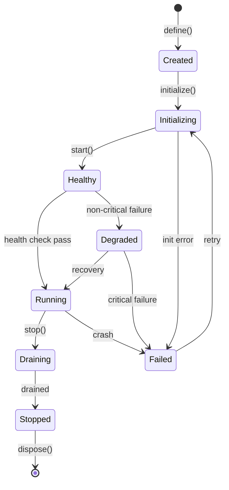
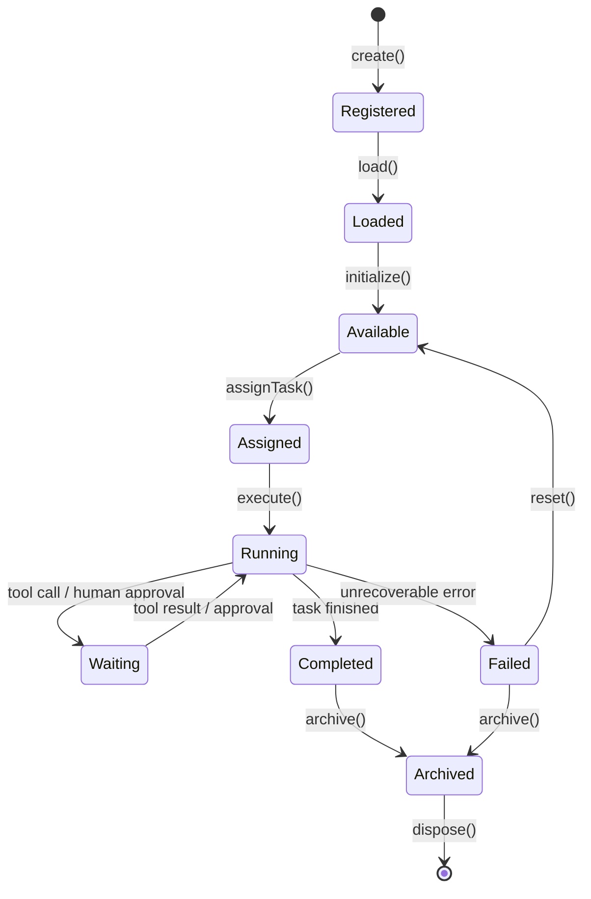
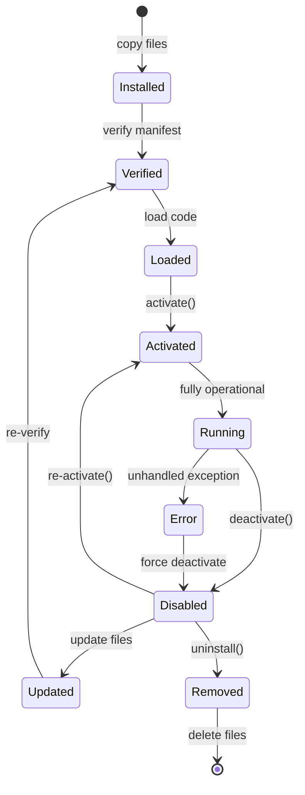
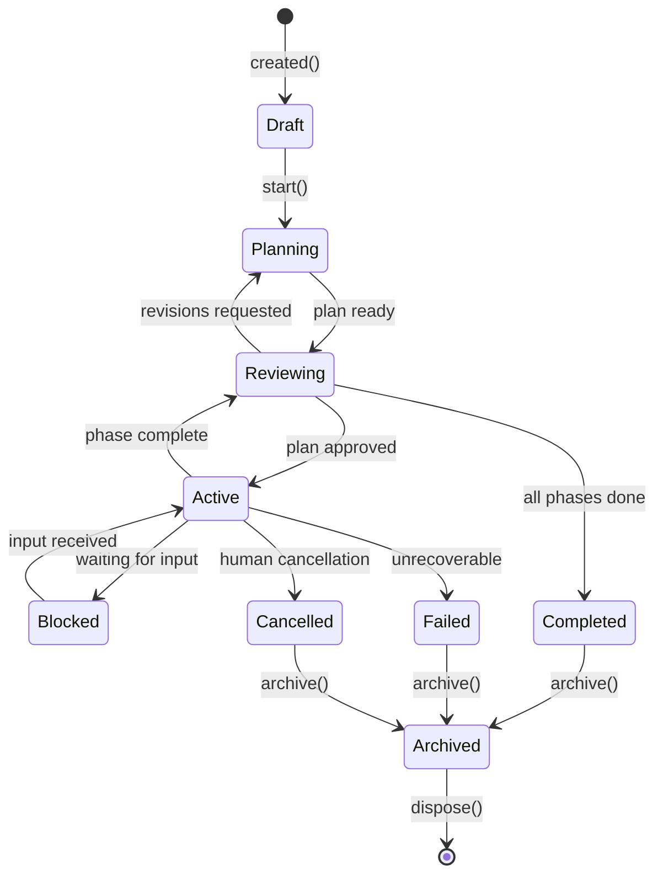

# Lifecycle Specifications
## Every Component in Vestara Follows the Same Lifecycle Pattern

> **No exceptions. Every service, agent, plugin, provider, tool, and mission follows a standardized lifecycle with defined states, transitions, events, and error handling.**

---

## Universal Lifecycle Pattern

All lifecycles follow this pattern:

| Phase | Description | Mandatory Events |
|-------|-------------|------------------|
| **Created** | Definition exists, not yet active | `*:created` |
| **Activating** | Transition to active state | `*:activating` |
| **Active** | Fully operational | — |
| **Degraded** | Running but with issues | `*:degraded` |
| **Deactivating** | Transition away from active | `*:deactivating` |
| **Inactive** | Not active, but not destroyed | — |
| **Error** | Unrecoverable state | `*:error` |
| **Destroyed** | Resources released | `*:destroyed` |

---

## 1. Service Lifecycle



```yaml
lifecycle: Service
states:
  - Created: "Definition exists"
  - Initializing: "initialize() in progress"
  - Healthy: "Ready, passing health checks"
  - Running: "Fully operational"
  - Degraded: "Running with non-critical issues"
  - Draining: "Draining in-flight work"
  - Stopped: "Stopped, can be disposed"
  - Failed: "Unrecoverable error"

transitions:
  Created → Initializing: "initialize() called"
  Initializing → Healthy: "initialize() + start() succeed"
  Initializing → Failed: "initialize() or start() throws"
  Healthy → Running: "health check passes"
  Healthy → Degraded: "non-critical failure detected"
  Degraded → Running: "recovery successful"
  Degraded → Failed: "critical failure, recovery failed"
  Running → Draining: "stop() called"
  Running → Failed: "unhandled exception"
  Draining → Stopped: "drain complete"
  Failed → Initializing: "retry initiated"
  Stopped → [*]: "dispose() called"

events:
  - "service:initialized"
  - "service:started"
  - "service:healthy"
  - "service:degraded"
  - "service:recovered"
  - "service:stopped"
  - "service:failed"
  - "service:disposed"

health:
  liveness: "Service is responsive"
  readiness: "Service can accept work"
  metric: "vestara.service.status{service=id}"
```

---

## 2. Agent Lifecycle



```yaml
lifecycle: Agent
states:
  - Registered: "Agent definition created"
  - Loaded: "Code loaded into memory"
  - Available: "Ready for task assignment"
  - Assigned: "Task received, not yet executing"
  - Running: "Actively executing"
  - Waiting: "Waiting for external input"
  - Completed: "Task finished successfully"
  - Failed: "Task failed"
  - Archived: "Preserved for history"

timeouts:
  maxExecutionTime: 300000        # 5 minutes default
  idleTimeout: 600000             # 10 minutes before auto-archive
  
events:
  - "agent:registered"
  - "agent:loaded"
  - "agent:available"
  - "agent:assigned"
  - "agent:execution.started"
  - "agent:execution.waiting"
  - "agent:execution.completed"
  - "agent:execution.failed"
  - "agent:archived"

metrics:
  - "vestara.agent.active{agent=id}"
  - "vestara.agent.execution.duration{agent=id}"
  - "vestara.agent.tools.invoked{agent=id,tool=id}"
```

---

## 3. Plugin Lifecycle



```yaml
lifecycle: Plugin
states:
  - Installed: "Files on disk, not yet verified"
  - Verified: "Manifest valid, permissions checked"
  - Loaded: "Code loaded, not yet activated"
  - Activated: "activate() called, capabilities registered"
  - Running: "Fully operational"
  - Disabled: "deactivate() called, files preserved"
  - Updated: "New files available, re-verification needed"
  - Error: "Unhandled exception during activation/running"
  - Removed: "Files deleted"

events:
  - "plugin:installed"
  - "plugin:verified"
  - "plugin:loaded"
  - "plugin:activated"
  - "plugin:disabled"
  - "plugin:updated"
  - "plugin:error"
  - "plugin:removed"

security:
  - "Manifest verification: required before load"
  - "Permission check: required before activate"
  - "Sandbox: required for all plugin code"
```

---

## 4. Mission Lifecycle



```yaml
lifecycle: Mission
states:
  - Draft: "Mission defined, not started"
  - Planning: "Planning agent decomposing goal"
  - Reviewing: "Plan or phase awaiting human review"
  - Active: "Execution in progress"
  - Blocked: "Waiting for external input"
  - Failed: "Objective not achievable"
  - Cancelled: "Manually cancelled"
  - Completed: "Objective achieved"
  - Archived: "Preserved for learning"

events:
  - "mission:created"
  - "mission:planning.started"
  - "mission:planning.completed"
  - "mission:planning.failed"
  - "mission:approved"
  - "mission:revisions.requested"
  - "mission:execution.started"
  - "mission:execution.blocked"
  - "mission:execution.unblocked"
  - "mission:phase.completed"
  - "mission:completed"
  - "mission:failed"
  - "mission:cancelled"
  - "mission:archived"

metrics:
  - "vestara.mission.active"
  - "vestara.mission.duration{status=type}"
  - "vestara.mission.success.rate"
```

---

## 5. Provider Lifecycle

```yaml
lifecycle: Provider
states:
  - Registered: "Provider configured, not yet verified"
  - Verifying: "Health check in progress"
  - Available: "Healthy, accepting requests"
  - Degraded: "High latency, rate limited"
  - Unavailable: "Service down, API key missing"
  - Removed: "Provider deconfigured"

transitions:
  Registered → Verifying: "healthCheck() called"
  Verifying → Available: "health passes"
  Verifying → Unavailable: "health fails"
  Available → Degraded: "latency threshold exceeded"
  Available → Unavailable: "service returns errors"
  Degraded → Available: "recovery"
  Degraded → Unavailable: "degradation timeout"
  Unavailable → Verifying: "retry health check"
  Unavailable → Removed: "provider removed"

events:
  - "provider:registered"
  - "provider:available"
  - "provider:degraded"
  - "provider:unavailable"
  - "provider:removed"
  - "provider:health.changed"

fallback_behavior:
  - "Available → Degraded: continue with warning"
  - "Degraded → Unavailable: fail over to next provider"
  - "All providers unavailable: return error, suggest local models"
```

---

## 6. Tool Lifecycle

```yaml
lifecycle: Tool
states:
  - Registered: "Tool registered with Tool Runtime"
  - Available: "Ready for invocation"
  - Executing: "Currently being invoked"
  - Failed: "Execution failed"
  - Deprecated: "Scheduled for removal"
  - Removed: "Tool unregistered"

transitions:
  Registered → Available: "registration complete"
  Available → Executing: "invocation received"
  Executing → Available: "execution completed"
  Executing → Failed: "execution failed with error"
  Failed → Available: "reset"
  Available → Deprecated: "deprecation notice"
  Deprecated → Removed: "removal date passed"

timeouts:
  defaultTimeout: 30000          # 30 seconds
  maxTimeout: 60000              # 60 seconds max

events:
  - "tool:registered"
  - "tool:executing"
  - "tool:completed"
  - "tool:failed"
  - "tool:deprecated"
  - "tool:removed"
```

---

## Lifecycle Observability

Every lifecycle event is:
1. **Logged** — Structured log with component ID, state, transition
2. **Metric** — Counter increment, histogram of state duration
3. **Emitted** — Event on EventBus for subscribers

```typescript
// Standard format for all lifecycle events
interface LifecycleEvent {
  componentType: 'service' | 'agent' | 'plugin' | 'provider' | 'tool' | 'mission';
  componentId: string;
  componentName: string;
  previousState: string;
  newState: string;
  transition: string;            // The action that caused transition
  duration: number;              // ms in previous state
  error?: string;
  timestamp: string;
}
```

---

## Lifecycle Enforcement

| Rule | Enforcement |
|------|-------------|
| Illegal transitions | Rejected with error message |
| State timeout | Automatic transition to error/failed |
| Missing dispose | Warning on shutdown, force cleanup after timeout |
| Concurrent state mutation | Lock per component, fail on conflict |
| State persistence | Critical states persisted for recovery |

---

*Every component in Vestara follows one of these lifecycle patterns. If it has a lifecycle, it's defined here. No exceptions.*
